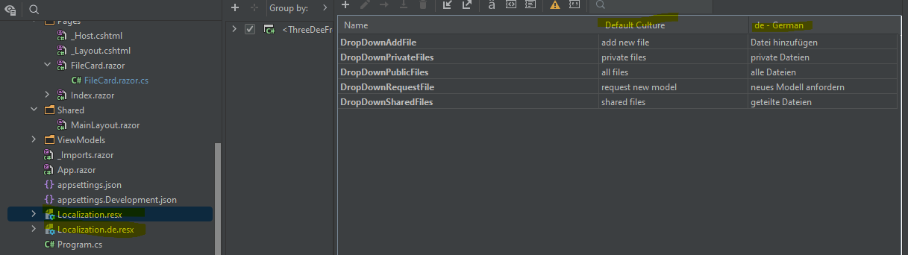

# Erläuterungen zum Template

In Klammern steht ob die jeweiligen Aussagen spezifisch für Blazor sind (dotnet Framework, welches C# als Sprache nutzt) oder allgemein für C# gelten.

## Beginner

### Markup, Code und Styling (Blazor)
Wie in klassischen Frameworks sind die Hauptkomponenten das Markup/Struktur (HTML), das Styling (CSS) und die Funktion/Verhalten (Code).

#### Markup
In Blazor können mit derselben Syntax sich öffnender und schließender Tags alle bekannten html Klassen, sowie eigene Klassen genutzt werden.

```html
<tagname>Inhalt</tagname>
```
oder
```html
<tagname/>
```

#### Styling
Das Styling erfolgt ebenfalls analog entweder global (Pfad zur style.css im root Pfad), über isolierte css Klassen (Dateien oder über das `<style>` Tag), welche genauso heißen wie die Komponente oder Page, oder inline.

**isoliert/global in Datei, z.B. index.razor.css**
```css
.center {
    margin: auto;
    box-shadow: rgba(0, 0, 0, 0.16) 0 1px 4px;
    border-radius: 4px;
}
```

**isoliert im Markup**
```html
<style>    
    .center {
        margin: auto;
        box-shadow: rgba(0, 0, 0, 0.16) 0 1px 4px;
        border-radius: 4px;
    }
</style>
```

**inline**
```html
<MudText Style="padding-top: 50px;">Files</MudText>
```

Isolierte CSS Identifier (Ids, Klassen) treten nicht mit Identifiern gleichen Namens in Konflikt, sofern diese in anderen isolierten Bereichen liegen. Dadurch kann man sehr modular arbeiten.

#### Code
C# Code kann innerhalb des Markups mit denselben syntaktischen Regeln wie auch sonst ausgeführt werden. Allerdings muss darauf mit einem `@` hingewiesen werden, sonst wird der Code einfach als Text gerendert. Auch aufgerufene Properties oder Methoden werden so annotiert:

```html
<div>
    @foreach (var file in _filteredFiles)
    {
        <p>Filename: @file.Name</p>
    }
</div>
```

Die UI-Logik der Komponente (Methoden etc.) befindet sich entweder in derselben .razor Datei oder in einer seperaten Datei, welche nach dem Schema Komponente.razor.cs benannt ist und als `partial class` deklariert werden muss. Wenn sich der Code in derselben Datei befindet muss er mit `@code{...}` annotiert werden:

```html
<PageTitle>3D File Management System</PageTitle>
<MudThemeProvider 
    IsDarkMode="@ThemeProviderService.IsDarkMode"
    IsDarkModeChanged="async x => await SwitchTheme(x)" 
    Theme="_theme"/>
<MudDialogProvider/>
<MudSnackbarProvider/>
<MudLayout>
    <MudAppBar Elevation="1">
        <MudText
            Typo="Typo.h5"
            Class="ml-3">
            Logo
        </MudText>
        <div class="d-flex justify-center flex-grow-1 gap-4">
            <DropDownMenu 
                Label="Library" 
                MenuItems="@TopMenuViewModel.LibraryItems"/>
            <DropDownMenu 
                Label="Files" 
                MenuItems="@TopMenuViewModel.FilesItems"/>
        </div>
        <MudSwitch 
            @bind-Checked="@ThemeProviderService.IsDarkMode"
            Color="Color.Primary" T="bool" 
            Label="@(ThemeProviderService.IsDarkMode ? "DARK" : "LIGHT")"/>
        <MudIconButton 
            Icon="@Icons.Material.Filled.ManageAccounts" 
            Color="Color.Inherit" 
            Edge="Edge.End" />
    </MudAppBar>
    <MudMainContent>
        @Body
    </MudMainContent>
</MudLayout>
```
```csharp
@code
{
    [Inject]
    private IThemeProviderService ThemeProviderService { get; set; }
    
    [Inject] 
    private ProtectedLocalStorage BrowserSettings { get; set; }
    
    private readonly MudTheme _theme = new();
    private const string SaveSettingsKey = "threedeedarkmodesetting";
    
    protected override async Task OnAfterRenderAsync(bool firstRender)
    {
        if (firstRender)
        {
            var result = await BrowserSettings.GetAsync<bool>(SaveSettingsKey);
            if (result.Success)
            {
                ThemeProviderService.IsDarkMode = result.Value;
            }
            StateHasChanged();
        }
    }

    private async Task SwitchTheme(bool isDarkTheme)
    {
        ThemeProviderService.IsDarkMode = isDarkTheme;
        await BrowserSettings.SetAsync(SaveSettingsKey, isDarkTheme);
    }
}
```

### Komponenten und Pages (Blazor)
Es gibt UI bezogen Komponenten und Pages. Beide werden in einzelnen Dateien gespeichert. Sie sehen fast gleich aus, bis auf den Identifier in der ersten Zeile bei der Page.  
Komponenten können (und sollen) **mehrfach** verwendet werden und können von anderen Komponenten oder Pages instantiiert werden.  
Pages mit dem jeweils eindeutigen Identifier nur **einmal**, da über den Identifier der Pfad definiert wird. Zudem können sie nicht von anderen Pages oder Komponenten instantiiert werden. Hier ruft die Page die Komponente SearchBar auf.

**Komponente (SearchBar.razor):**
```html
<MudAutocomplete
        T="string"
        Immediate="true"
        Label="Suche in verfügbaren Modellen"
        @bind-Value="_selectedValue"
        AdornmentIcon="@Icons.Material.Filled.Search"
        AdornmentColor="Color.Primary"
        SearchFunc="@Search"/>
```

**Page (Index.razor):**
```html
@page "/"
<MudContainer MaxWidth="MaxWidth.Large">
    <MudText Style="padding-top: 50px;" Typo="Typo.h2">Files</MudText>
    <SearchBar 
        FilteredFilesHaveChanged="async (v) => await OnFilteredValueChanged(v)"/>
    <MudGrid Style="margin-top: 25px;">
        ...
    </MudGrid>
</MudContainer>
```

### Parameter (Blazor)
Komponenten oder Seiten, welche andere Komponenten instantiieren, können diesen über Parameter bestimmte Startwerte übergeben (ähnlich eines Konstruktors). Eine Veränderung des Wertes führt zum Rerendering der Komponente (und ausschließlich den betroffenen Teilen des DOM).  
Im Beispiel der Searchbar sieht das Codebehind in der Datei SearchBar.razor.cs so aus:

```csharp
public partial class SearchBar
{
    [Parameter]
    public EventCallback<List<FileModel>> FilteredFilesHaveChanged { get; set; }
```

Auf der Page Index.razr (s.o.) wird vor der schließenden Klammer `>` des öffnenden Tags `<SearchBar` der Wert des Parameters gesetzt (hier eine Callbackfunktion). Parameter müssen mit dem `[Parameter]` **Decorator** versehen werden, **public** sein und über einen **getter und setter** verfügen.

### Properties (C#)
C# benötigt anders als Java keine Referenzen öffentlicher Properties auf private Felder. Properties werden über die Keywords `get;` oder `set;` (alternativ `init;` oder `private set;`) in Verbindung mit dem `protected, internal oder public` Access Modifier initialisiert. 

```csharp
public List<int> Ages { get; } = new();
public List<int> Numbers { get; private set; } = new();
```

Sie können aber auch (analog zu den Gettern und Settern in Java) zusätzlich weitere Aufrufe enthalten. (z.B. ein ausgelöstes Event wenn der Wert sich ändert).
```csharp
public string UserName 
{ 
    get => _username;
    set
    {
        _username = value;
        OnUsernameChanged.InvokeAsync(_username);
    }
}

private string _username;
```

Valuetypes haben automatisch einen Wert wenn ihnen keiner zugewiesen wird (bool: false, int: 0). Properties mit Referencetype sollte entweder direkt oder über den Konstruktor ein Wert zugewiesen werden, ansonsten können sie als nullable reference types deklariert werden:

```csharp
public int Age { get; } // keine Warnung
public string FirstName { get; } // Warnung
public string SurName { get; } = ""; // keine Warnung
public string? SurName { get; } // keine Warnung, aber Warnung beim Aufrufer
```

Startwerte können in C# alternativ oder zusätzlich zum Konstruktor mit den Properties gesetzt werden. Wenn sie public setter haben, können sie auch nachträglich verändert werden:

```csharp
public class UserModel
{
    public int Age { get; set; }
    public string Name { get; }
    private _id;
    
    pulic UserModel(int id)
    {
        _id = id;
    }    
}

public class UserModelCaller
{
    private int _idIncrement;
    
    public void UseModel()
    {
        var user = new UserModel(_idIncrement)
        {
            Age = 22, // könnte man auch weglassen, die ID jedoch nicht
            Name = "Somone"
        }
        user.Age = 23; //geht
        user.Name = "Someone else"; // geht nicht
    }    
}
```

### Program.cs und Properties/launchsettings.json
Die Program.cs ist bei ASP.NET Web (also auch bei Blazor) der Einstiegspunkt de Programms, also analog zur Main in Konsolenanwendungen oder Java. Erstmal nicht weiter drum kümmern, die braucht ihr erst wenn ihr eigene Services registrieren wollt (s. intermediate) weil sie später injected werden sollen.

```csharp
builder.Services.AddHttpClient();
builder.Services.AddMudServices();
builder.Services.AddScoped<TopMenuViewModel>();
builder.Services.AddScoped<IJsInteropService<ModelRenderer>, JsInteropService<ModelRenderer>>();
builder.Services.AddScoped<IThemeProviderService, ThemeProviderService>();
```

In der launchsettings.jon könnt ihr z.B. den Port ändern unter dem die Anwendung lokal läuft (falls es da nen Konflikt geben sollte).
```json
{
  "profiles": {
    "MinimalFrontend": {
      "commandName": "Project",
      "dotnetRunMessages": true,
      "launchBrowser": true,
      "applicationUrl": "https://localhost:5001;http://localhost:5000",
      "environmentVariables": {
        "ASPNETCORE_ENVIRONMENT": "Development"
      }
    }
  }
}
```

### Aufruf JS Methoden
Javascript kann in Blazor über die JSInterop Library aufgerufen werden, welche in einer Blazor Solution automatisch integriert ist. Für kleinere Projekte kann im Webroot-Folder eine einzelne .js Datei angelegt werden, welche global in der _Layout.cshtml referenzoert wird und dann von allen Blazor Komponenten oder Pages aufgerufen werden kann. Für größere Projekte können auch modulbasierte .js Dateien verwendet werden.
Die Registrierung bzw. die Aufrufe dürfen in der jeweiligen Komponente oder Page frühenstens in der OnAfterRender Methode (wichtig: nicht in OnParameterSet oder OnInitialized, das wird ne Exception schmeißen) aufgerufen werden.

#### Globale Verwendung
Im Body der _Layout.cshtml (bzw. der index.html bei Webassembly) wird die Datei folgendermaßen referenziert:
```html
<script src="subfolderXYZ/dateiname.js"></script>
```
In Komponenten oder Pages, in welchen Javascriptfunktionen aufgerufen werden sollen, muss ein IJSRuntime Objekt injiziert werden (eine Registrierung des Services in der Program.cs ist nicht notwendig, weil es ein Standardservice ist):

```csharp
[Inject]
public IJSRuntime JsRuntime { get; set; }
```

Beispielhaft die javascript Funktionen (ohne Rückgabe), die über CSharp aufgerufen werden sollen:
```js
async function keineRueckgabeKeineParameter(){
    console.log('hello world')
}

async function keineRueckgabeMitParameter(paramOne, paramTwo){
    console.log(paramOne + paramTwo)
}
```

Der Aufruf der JS Funktionen erfolgt dann so:
```csharp
// keine Rückgabe, keine Parameter
await JsRuntime.InvokeVoidAsync("keineRueckgabeKeineParameter");

// keine Rückgabe, mit Parameter
await JsRuntime.InvokeVoidAsync("keineRueckgabeMitParameter", "hello", "world");
```

Funktionsaufrufe mit Rückgabe müssen über InvokeAsync<T> erfolgen. Nutzt primitive Datentypen, wenn javascript json Objekte zurückgibt müssen diese mit dem JsonDeserializer deserialisiert werden (vice versa wenn json Objekte als Paramter erwartet werden). Ist erstmal egal, deshalb Beispiele mit strings. 

Aufzurufende js Funktionen:
```js
async function mitRueckgabeOhneParameter(){
    return 'hello world'
}

async function mitRueckgabeMitParameter(paramOne, paramTwo){
    return paramOne + paramTwo
}
```

Aufruf in C#:
```csharp
// mit Rückgabe, keine Parameter
string returnValueOne = await JsRuntime.InvokeAsync<string>("mitRueckgabeOhneParameter");
Console.WriteLine(returnValueOne);

// mit Rückgabe, mit Parameter
string returnValueTwo = await JsRuntime.InvokeVoidAsync("mitRueckgabeMitParameter", "hello", "world");
Console.WriteLine(returnValueTwo);
```

#### Modulbasierte Verwendung
Die globale Referenzierung ist hier nicht notwendig, dafür muss die .js Datei in der Komponente oder Page (oder beliebigen Services, die von den Komponenten verwendet werden) initialisiert werden.

Die js Funktionen müssen mit export als Module markiert sein:

```js
export async function mitRueckgabeOhneParameter(){
    return 'hello world'
}
// usw.
```

Beispiel für Initialisierung in einer Komponente mit Namen "DropdownSelection":

```csharp
[Inject]
public IJSRuntime JsRuntime { get; set; }
private IJSObjectReference _module;

// Registrierung
protected override async Task OnAfterRenderAsync(bool firstRender)
{
    if (firstRender)
    {
        var jsApiModule = new Lazy<Task<IJSObjectReference>>(() => JsRuntime
            .InvokeAsync<IJSObjectReference>(
                "import", "./subfolderXYZ/dateiname.js").AsTask());
        _module = await _jsApiModule.Value;        
    }
}
```

Aufruf der Funktionen über das Modul statt über das Runtimeobjekt:
```csharp
// keine Rückgabe, keine Parameter
await _module_.InvokeVoidAsync("keineRueckgabeKeineParameter");

// keine Rückgabe, mit Parameter
await _module.InvokeVoidAsync("keineRueckgabeMitParameter", "hello", "world");

// mit Rückgabe, ohne Parameter
string returnValueOne = await _module.InvokeAsync<string>("mitRueckgabeOhneParameter");
Console.WriteLine(returnValueOne);

// mit Rückgabe, mit Parameter
string returnValueTwo = await _module.InvokeVoidAsync(
    "mitRueckgabeMitParameter", "hello", "world");
Console.WriteLine(returnValueTwo);
```

### Localization
String, welche in der UI angezeigt werden, sollten nicht direkt in den Komponenten hardgecoded werden. Egal ob die Anwendung ein- oder mehrsprachig ist, die Referenzierung erfolgt ober sog. Localizationfiles (.xml). Wenn mehrere Sprachen verwendet werden, muss einfach eine weitere Datei mit demselben Namen plus Sprachcode (hier de) erstellt werden. Nach der Erzeugung der Datei erfolgt die Bearbeitung in der IDE über ein integriertes Tool (Rider und Visual Studio):



Da die automatisch generierte .cs Klasse statisch ist, erfolgt der Aufruf auch statisch über Klassenname.Property:

```html
<p>Unternehmensname: @Localization.CompanyName</p>
```

oder in C# (s. TopMenuViewModel.cs):

```csharp
public List<DropDownMenuItemModel> LibraryItems { get; } = new()
{
    new(Localization.DropDownPublicFiles, "/"),
    new(Localization.DropDownSharedFiles, "/"),
    new(Localization.DropDownPrivateFiles, "/"),
};
```

### Standards
Kleine Auswahl an Standards (teilweise C# spezifisch):
- Schreibweise immer CamelCase
- Parameter klein
- Properties groß
- Felder klein mit underscore
- Konstanten groß
- lokale Variablen klein ohne underscore
- Methodennamen groß
- Klassennamen groß: `Klassenname`
- Interfaces analog der Klasse mit "I" davor: `IKlasenname`
- strings mit doppelten Anführungszeichen: `"name"`
- chars mit einfachen Anführungszeichen: `'A'`
- Statements werden mit einem Semikolon beendet
- geschweifte Klammern werden in einer neuen Zeile geschrieben

```csharp
// Properties
public string PropertyName { get; set; }
private string PropertyName { get; set; }

// Felder
private string _propertyName;

// Konstanten
private const string Endpoint = "/abc";

// Konstruktor
public Klassenname(object objectOne, objectTwo)
{
    // do stuff
}

// Methode
private int Methodenname(int integerOne)
{
    // lokale Variable
    int integerTwo = 42;
    return intgerOne + integerTwo;    
}
```

Variablen können explizit oder implizit deklarirt werden. Strings könnt ihr komfortabel über Interpolation zusammenfügen:

```csharp
private string Methodenname(int integerOne)
{
    // explizit typisierte lokale Variable
    int integerTwo = 42;

    // implizit typisierte lokale Variable
    var stringOne = "Hello World";

    // Stringinterpolation
    return $"{stringone}, {integerOne} plus {integerTwo} ist {integerOne + integerTwo}"
}
```

Die Initialisierung von Objekten kann in mehreren Varianten erfolgen:

```csharp
Klassenname objektNameOne = new();

// oder
var objektnameTwo = new Klassenname();
```

Wenn der Objekttyp z.B. über eine Liste bereits deklariert ist:
```csharp
public class User
{
    private string _age;
    private string _name;

    public User(int age, string name)
    {
        _age = age;
        _name = name;
    }
}

List<User> users = new()
{
    new(20, "UserOne"),
    new(30, "UserTwo")
}
```

## Intermediate
### Blazor Server vs. Blazor Webassembly
Blazor bietet beide Möglichkeiten. In Serverprojekten findet nach dem klassischen Client Server Modell der Workload beim Server statt und die generierten Dateien beim Client (Brower) gerendert. WebAssembly ist noch relativ neu und nutzt die immer performanteren Prozessorkapazitäten beim Client. Das initiale Laden der Dateien dauert länger, der Workload ist beim Client angesiedelt und alle anschlißenden Prozesse sind deutlich schneller.  

Letzteres Modell eignet sich besser für komplexe Anwendungen, die relativ unabhängig von externen Services sind. Es reicht ein kleiner Server, d.h. die Skalierbarkeit ist besser. Beide Modelle können auch als Hybridlösung kombiniert werden.  

Was für uneren Usecase besser ist müssen wir zusammen überlegen. Das Template ist als Serverprojekt angelegt, eine Umstellung ist aber relativ einfach falls wir doch Webassembly nutzen wollen.

mehr dazu hier: [MS Doku Blazor Hostingmodelle](https://learn.microsoft.com/de-de/aspnet/core/blazor/hosting-models?view=aspnetcore-7.0)

### async und await


### Lambdas
### Events und Event Callbacks
### Dependency Injection
### UnitTests
### Navigation
### Browser Storage
### Generische Typen
### One und Two Way Binding
### Docker

## Advanced
### Clean Architecture 
### Lifecycles
### Repository Pattern
### MVVM Pattern,
